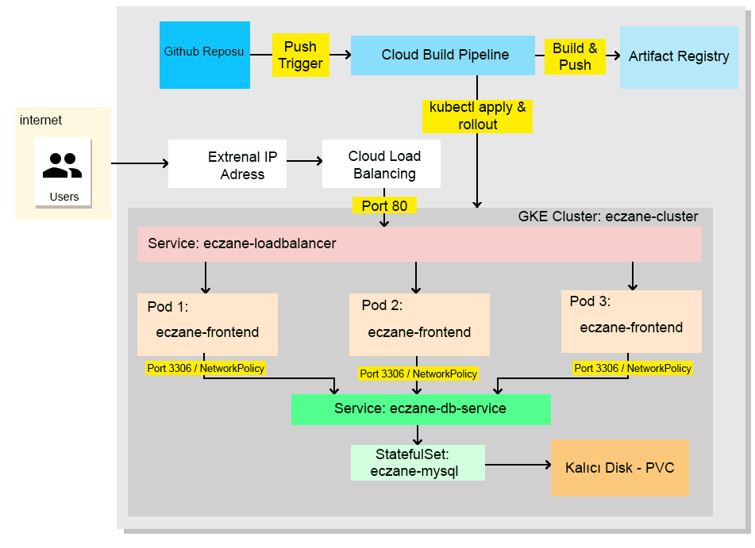

# e-Ecza Otomasyon ve Dağıtım Projesi

Bu proje, bir web uygulamasının Docker konteyner haline getirilerek Google Kubernetes Engine (GKE) üzerinde yüksek erişilebilirlik, ağ güvenliği, kalıcı veri depolama ve tam otomatik bir CI/CD boru hattı (Pipeline) ile canlıya alınmasını içeren uçtan uca bir DevOps mimarisidir.

## Sistem Mimari Şeması
Projenin internet trafiği ve CI/CD otomasyon akışı aşağıdaki şemada modellenmiştir:


## Kullanılan Teknolojiler ve Altyapı
* **Web Uygulaması:** PHP 8.2 & Apache Sunucusu
* **Veritabanı:** MySQL 8.0 (StatefulSet)
* **Bulut Sağlayıcı:** Google Cloud Platform (GCP)
* **Konteyner Yönetimi:** Google Kubernetes Engine (GKE)
* **Konteyner Deposu:** GCP Artifact Registry
* **CI/CD Otomasyonu:** GCP Cloud Build & GitHub Webhooks

---

## Proje Yapısı ve Dosya Görevleri

```text
├── app/                  # Web uygulamasının kaynak kodları (PHP/HTML)
├── k8s/                  # Kubernetes Manifest Dosyaları
│   ├── secret.yaml       # Veritabanı şifrelerinin şifreli (Base64) tutulduğu kasa
│   ├── database.yaml     # MySQL StatefulSet, ClusterIP ve Kalıcı Disk (PVC) tanımları
│   ├── frontend.yaml     # Web uygulaması Deployment (3 Replicas) ve LoadBalancer servisi
│   └── networkpolicy.yaml# Web ve DB arasındaki ağ güvenlik duvarı kuralları
├── Dockerfile            # Uygulamanın imaj derleme tarifi
└── cloudbuild.yaml       # GitOps mantığıyla çalışan otomatik CI/CD yapılandırması
```

### Kubernetes Bileşenleri ve Mimari Tasarım

**1. Yüksek Erişilebilirlik ve Ölçekleme (Scaling & Rolling Update)**
Web uygulaması frontend.yaml içerisinde replicas: 3 olarak ayarlanmıştır. Google Cloud Load Balancer, dışarıdan gelen trafiği bu 3 pod arasında dengeli dağıtır. Güncelleme esnasında Rolling Update stratejisi sayesinde eski podlar tek tek kapatılıp yeni podlar devreye alınır, böylece kullanıcılar sitede 1 saniye bile kesinti yaşamaz.

**2. Veri Kalıcılığı (StatefulSet & PVC)**
Veritabanı gibi veri tutarlılığı kritik olan yapılar için Deployment yerine StatefulSet mimarisi tercih edilmiştir. volumeClaimTemplates kullanılarak Google Cloud üzerinden 2Gi Kalıcı Disk (PVC) rezerve edilmiştir. Pod çökse veya silinse dahi nöbetçi eczane ve ilaç verileri asla kaybolmaz.

**3. Sıfır Güven Ağ Güvenliği (NetworkPolicy)**
Kubernetes'in varsayılan açık ağ mimarisi kısıtlanmış ve networkpolicy.yaml ile Zero-Trust yaklaşımı uygulanmıştır. Veritabanının 3306 portu, cluster içindeki diğer tüm podlara kapatılmış; yalnızca app: eczane-frontend etiketine sahip web podlarına "Beyaz Liste" (Whitelist) izni verilmiştir.

## Otomatik CI/CD ve Kusursuz Rollback Altyapısı
Projede gerçek dünya kurumsal GitOps standartları uygulanmıştır. Süreç şu şekilde işler:

1. Geliştirici kodda bir değişiklik yapıp GitHub'a git push attığında Cloud Build Trigger otomatik tetiklenir.
2. Cloud Build, izole bir geçici alanda (Workspace) kodu klonlar, anlık Git Commit SHA kodu ve latest etiketleriyle Docker imajını derler ve Artifact Registry'ye yükler.
3. Kubernetes'in değişkenleri doğrudan okuyamaması problemini çözmek için cloudbuild.yaml içinde sed komutu çalıştırılır. frontend.yaml içindeki latest ifadesi anlık Commit SHA ile havada değiştirilir.
4. Güncel dosya kubectl apply ile kümeye gönderilir.

## Rollback (Sürüm Geri Alma) İşlemi
İmajlar kalıcı ve benzersiz Commit SHA kodlarıyla mühürlendiği için, canlıya hatalı bir kod çıktığında sistemde kesinti yaşanmadan tek bir komutla saniyeler içinde bir önceki stabil çalışan sürüme dönülebilir:

```bash
kubectl rollout undo deployment/eczane-web-deployment
```

## Kurulum ve Canlıya Alma Adımları:

```bash
# 1. Şifre kasasını oluştur
kubectl apply -f k8s/secret.yaml

# 2. Kalıcı diski ve Veritabanını ayağa kaldır
kubectl apply -f k8s/database.yaml

# 3. Web uygulamasını ve internet bağlantısını (LoadBalancer) aktif et
kubectl apply -f k8s/frontend.yaml

# 4. Mikroservis izolasyon güvenlik duvarını ör
kubectl apply -f k8s/networkpolicy.yaml

# Sistem durumunu ve sunucu makinelerini takip etmek için:
kubectl get nodes

# Çalışan web ve veritabanı konteynerlerini (Podları) görmek için:
kubectl get pods

# Sitenin internete açılan Dış IP (External IP) adresini öğrenmek için:
kubectl get svc
```